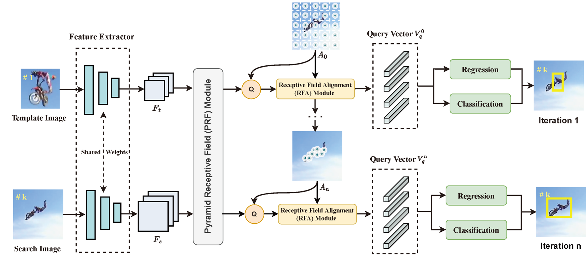

# A3Track: Achieving Precise Target Tracking in Aerial Images with Receptive Field Alignment

**Abstract**: Tracking arbitrary objects in aerial images presents formidable challenges to existing trackers. Among these challenges, the large scale variation and arbitrary geometry shape of visual targets are pronounced, resulting in two-fold mismatch issues between the feature receptive field and the tracking target.
For one, there is a mismatch between the prior receptive field center and arbitrary-shaped targets. For another, the single receptive field mismatches the significantly scale-varied targets in the aerial imagery. To handle these challenges, we propose to Achieve precise Aerial tracking with receptive field Alignment, dubbed A3Track. The proposed A3Track is comprised of two modules: a Receptive Field Alignment (RFA) module and a Pyramid Receptive Field (PRF) module. First of all, we transform and update the receptive field center progressively, which drives the feature sampling location onto the targets' main body, thus gradually yielding precise feature representation for arbitrary-shaped targets. We term this progressively updating process as the Receptive Field Alignment. Moreover, the PRF module constructs a set of pyramid features for the target, providing a multi-scale receptive field to handle the large scale variation of tracking objects. On four benchmarks, the new tracker A3Track achieves leading performance compared with existing methods and shows consistent improvements over baselines.



## Installation and Get Started

**Required enviroments:** 

Note that this implementation is based on Pytorch

* Linux
* Python 3.6
* Pytorch 1.5+
* CUDA 9.2
  
**Install:**
Assume that your environment has satisfied the above requirements, please follow the following steps for installation.

```shell script
git clone https://github.com/chnleixu/A3Track-Code.git
conda create -n A3Track python=3.6
pip install -r requirements.txt
```
Download pretrained model by [Googledrive](https://drive.google.com/file/d/1k3hFjF9MJmiqBIZ5xLDx0t1k1IXtlzRo/view?usp=sharing) and put them into `A3Track-Code` directory. . Download testing datasets and put them into `A3Track-Code/test_dataset` directory.  
```shell script
cd A3Track-Code
source activate A3Track
python pysot_toolkit/tests/testA3Track.py --dataset 'DTB' --dataset_root 'test_dataset/DTB70'
python pysot_toolkit/tests/testA3Track.py --dataset 'UAV10' --dataset_root 'test_dataset/UAV123@10fps/data_seq'
python pysot_toolkit/tests/testA3Track.py --dataset 'UAVTrack112' --dataset_root 'test_dataset/V4RFlight112'
python pysot_toolkit/tests/testA3Track.py --dataset 'UAVDT' --dataset_root 'test_dataset/UAVDT'
```
The testing result will be saved in the `results/dataset_name/tracker_name` directory.
**Note:** The results of A3Track can be [downloaded](https://drive.google.com/drive/folders/1CPY7aciKu59NTFyu2glXNIvJPX9MauLl).
(Continue to update)

## Acknowledgement
The work is implemented based on pysot and gets inspiration from excellent works of vision4robotics. We would like to express our sincere thanks to the contributors. 